# M4 Grading Test Suite

You can use the GitHub Actions workflow to run your tests and send a link to the results to your Instructor.

## Detailed Guide with Pictures

### Fork the Repo

Click the "fork" button in the top right corner of this page.
 

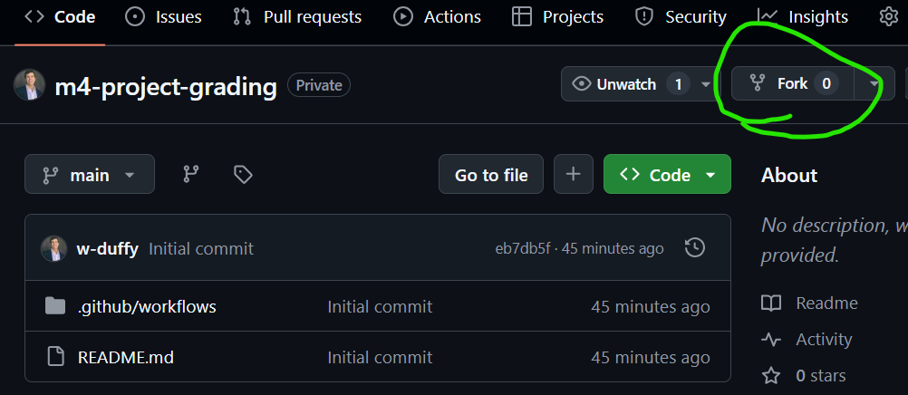
 

Change the Owner to your GitHub username, and then click "Create fork".
 

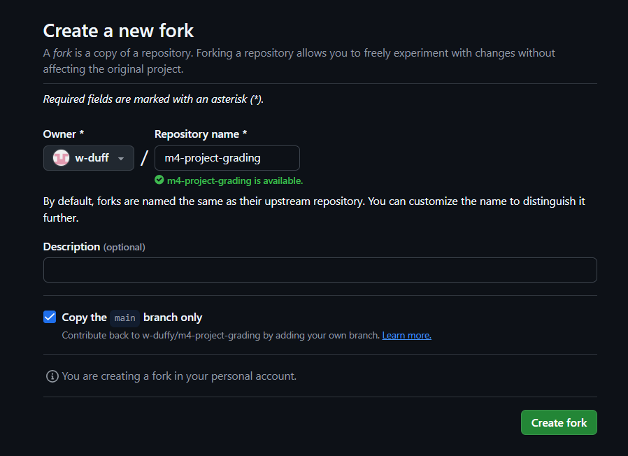
 

Here's what it'll look like when you've forked the repo:
 

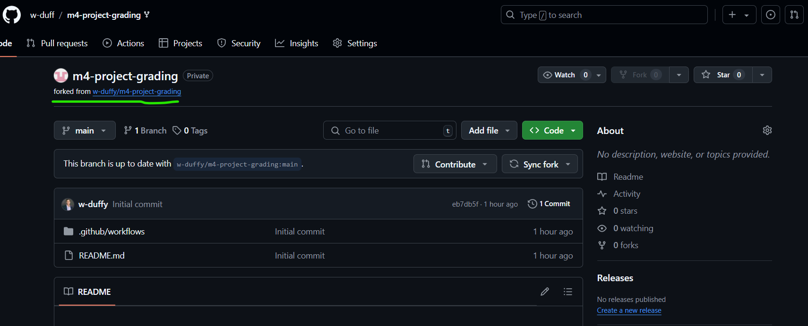
 

### Run the Action

You can access the action by clicking the "Actions" tab or "Run Your Tests" button listed below.
- 
 

 

Click the "I understand my workflows, go ahead and enable them" button.
 

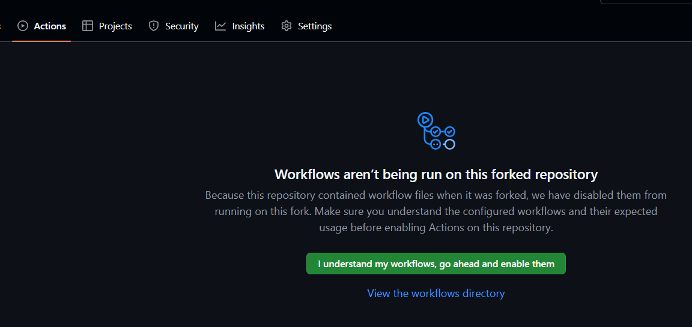
 

Click "M4 Team Project Mocha Tests"
 

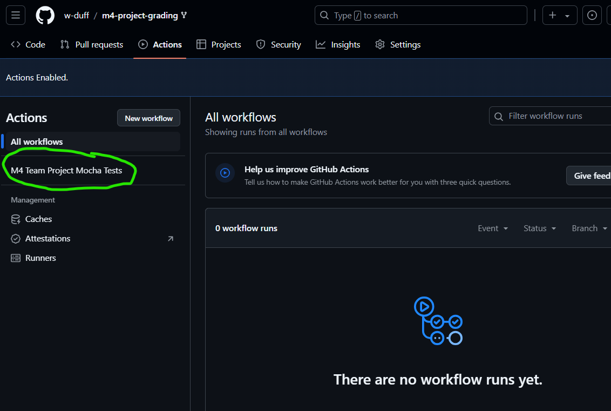

 

And then click "Run Workflow"
 

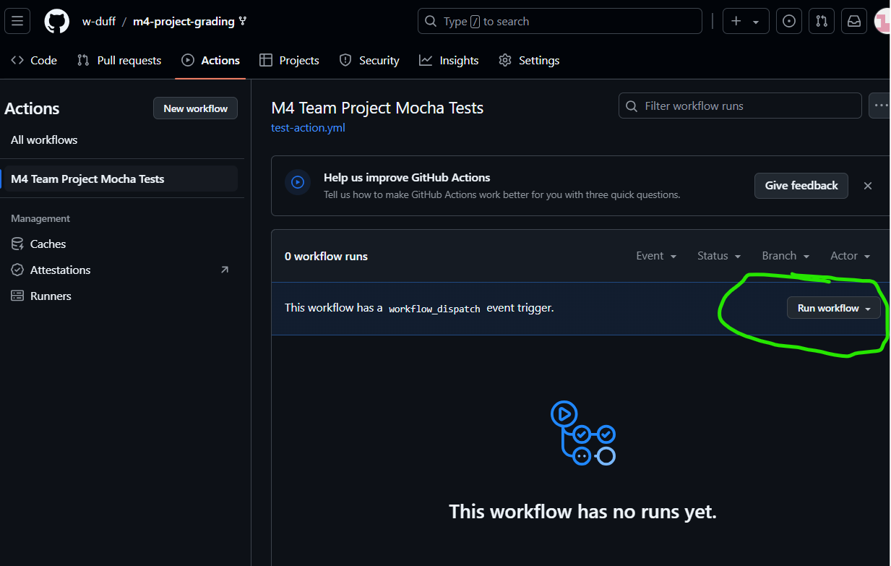
 

Add your Render API URL to the "render_url" input, and click "Run Workflow"
 

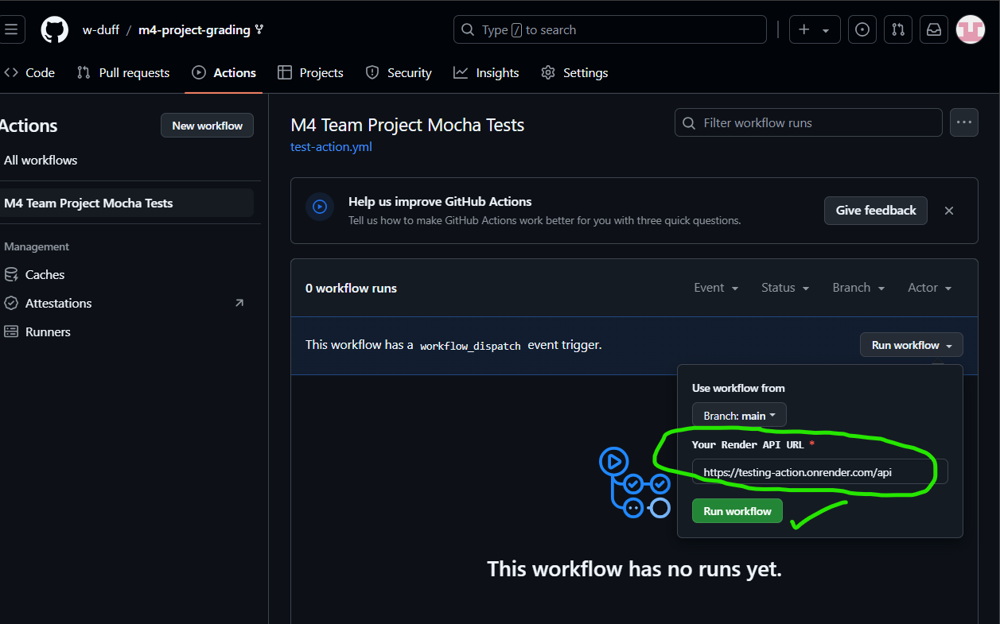

 

It will take a moment to start the tests, but then you'll see the tests running.

 

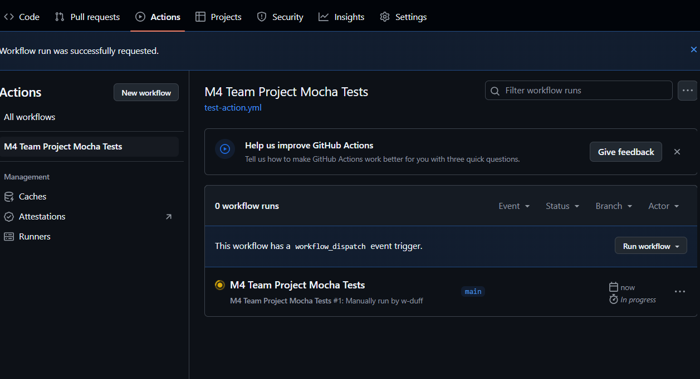
 

Click in to see the live results.
 

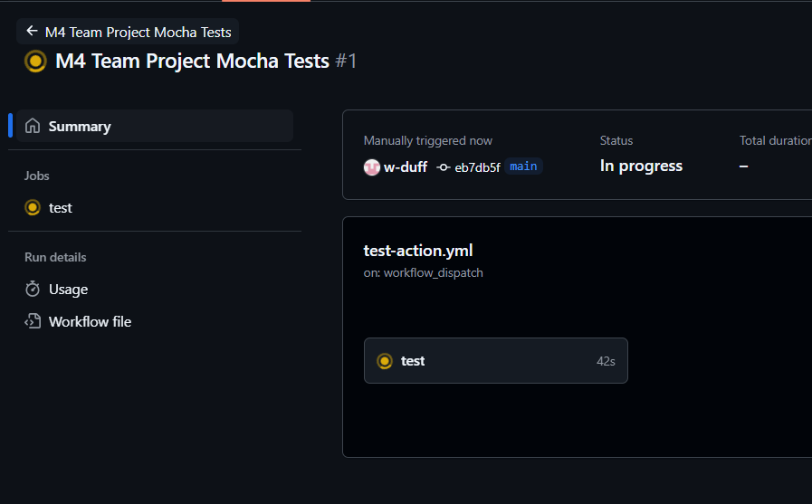
 

 

 

Here's what you'll see when the tests are done:
 

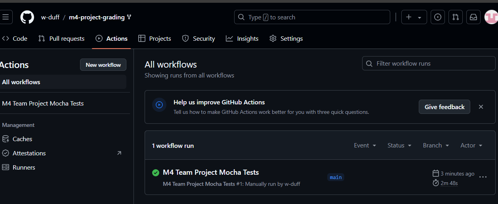
 

## How to Interpret the Results 🌟

You can run the workflow multiple times, and the results will be appended to the end of the previous results.

The results will look something like this:
 

 

The green checkmark means the test passed, and the red X means the test failed.

## An X doesn't necessarily mean the tests failed

The tests are run all at once, and then again for individual tests to account for network issues.

If you see a test failed in the large group of tests, but passed in the individual tests or vice versa, that is okay for passing; just let your instructor know which results to inspect.
 

### Example Passing Result with Failed Individual Tests

Here is an example where the large suite of tests passed, but one of the individual tests failed.  This is a passing result.
 

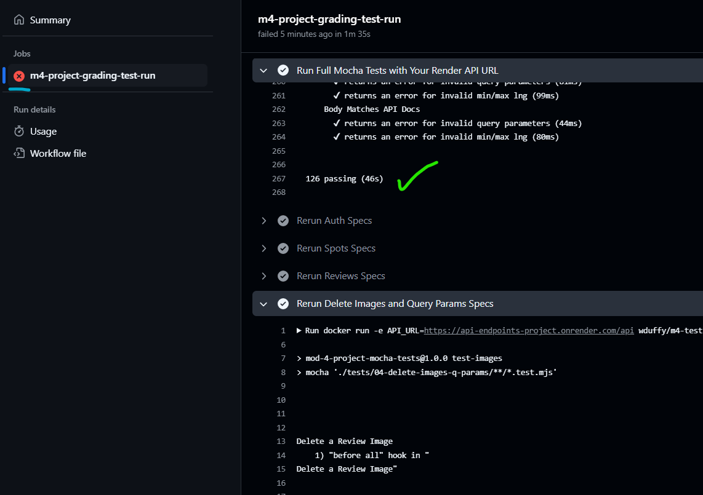
